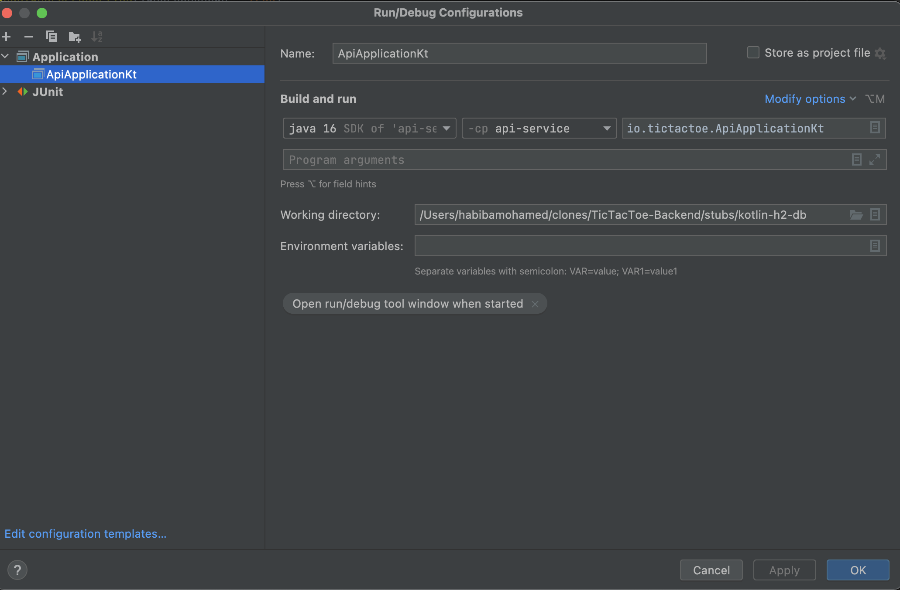

> ### Kotlin tic tac toe h2 db
> 
> [Lucid Chart](https://lucid.app/lucidchart/e15ff832-5667-4bb3-9f81-32f61b2dd716/edit?invitationId=inv_9422d646-c9e7-487d-86da-3b7f45bb8b5e#)
> 
> [Postman Collection](TicTacToe.postman_collection.json)
>
> Habiba Mohamed

# How it works

The application uses Spring (Web, Data, AOP, Cache) and the Kotlin language.

    Hexagonal architecture
    + api-adapter /
        - Would configure outside clients
    + api-api/
        - API Interface, DTOs (Object for REST in/out operations)
    + api-service/
        - Resource, exceptions classes, game logic
        - ApiApplication.kt <- The main class
        - Resource tests
        - Unit tests for game logic

# Database

It uses a H2 in memory database (for now), can be changed easily in the `application.properties` for any other database.
You'll need to add the correct maven dependency for the needed `Driver` in `pom.xml`.

# Getting started

You need Java(Open JDK 16) and maven installed.

    1. Open project with the Intellij IDEA. And create a configuration with OpenJDK 16 or newer as shown below.
    
# 

    2. Open http://localhost:8080

